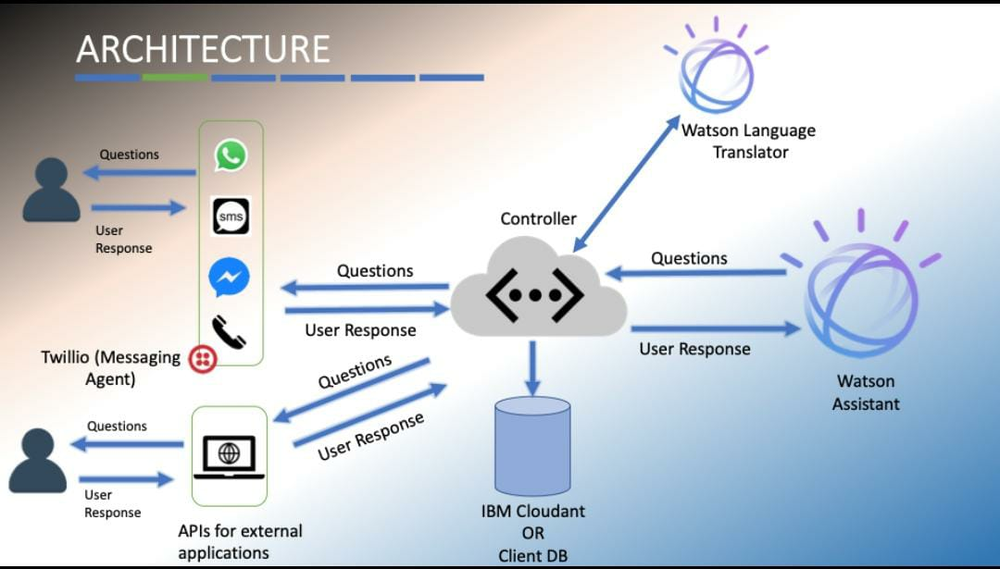

# Citizen Information Gather System using Context Sensitive Assistant- An IBM-GRM Project

### Description:
Gathering citizen's information easily is a very tough job for interested authorities. But it is one of the key aspects of providing necessary services to citizens. As a part of this project, we have built an easy and intuitive Multi-Lingual Context Sensitive Citizen Assistant to gather citizens information through multiple channels using AI.
The Assistant understands the context of what the citizen wants to do and performs the relevant task. It extracts relevant information from the conversation and stores the citizen's information for further processing. This system is scalable, modular and can be easily integrated with existing information retrieval/collection systems using REST-APIs

### Functionalities:
1. Information gathering through multiple channels.
2. Multilingual chat facility.
3. IVR functionality for information gathering via phone call.
4. Context Sensitive Assistant that can understand and remember conversation context and respond accordingly.
5. Easy integration with other services using Rest APIs.

### How does it work? (Architecture):
The arhictecture of the entire system can be split into 5 modules & 1 independent module namely : 
1) **The User Interface end**
This is the user side of the system, all the information is retrived from this end. To ease the information gathering process, multiple & intuitive channels like Phone call ,SMS, Whatsapp, Facebook Messenger.

2) **Translator**
Since the system has miltilingual support, a translator service (By Default IBM Watson Language Translator) is used. Once a message is received from the user interface end, the message is processed by the translator service which auto-detects the language from the incoming message, translates it to english and sends the message to be processed by the Assistant, it then also translates the outgoing message (reply from assistant) from english to the original language in which the message was received.

3) **Natural Language Processor/Assistant**
The Natural Language Processor is the core module responsible for the conversation, it is also called the Assistant (By Default IBM Watson Assistant). The assistant is context sensitive, meaning it can understand the context of the ongoing conversation and act & reply accordingly.

Image representation is as follows

4) **Middleware (Controller)**
The middleware module is essentially a controller. The controller is responsible for maintaining the flow of the system's execution. All incoming requests & outgoing responses are directed through the controller.

5) **Database/Storage**
The database module is where the gathered information is stored. This can be a NoSQL (By Default IBM Cloudant) or an SQL database.

Image representation is as follows: 

6) **Interactive Voice Response**
The IVR module is an independent module that is not connected to the middleware. It is directly connected to the aforementioned assistant using the IBM Voice Agent. Phone Call functionality is provided by Twilio. The incoming audio call is routed from Twilio to Voice Agent via SIP Trunking (Origination endpoint). For outbound calls the Voice Agent is directed to Twilio via the SIP Trunk(Termination endpoint). Outbound calls are not available on the free lite plan.

### Screenshots:

### Prerequisities:
- For using IBM Watson services you will need an IBM Cloud account
- For using SMS, Phone call &/or whatsapp services you will need a Twilio account
- For using Assistant, you will need an instance of IBM Watson Assistant service
- For using Translator, you will need an instance of IBM Watson Language Translator service
- For using CloudantDB, you will need an instance of IBM Cloudant service

### API reference:
|  Endpoints | Description   | Method | Content Type
|---|---|---|---|
| {messageService}/recv  |  A request to this endpoint returns the assistant's response to the messageService selected. Set request Body with the message that you want to send to the assistant.  |POST|application/x-www-form-urlencoded|
    Example: A post request sent from a messaging service like Twilio, using SMS service
    POST: whatsapp/recv => Body = {body: "Hello, Good Morning!"}
    
    Response [String]: "Welcome to Citizen Assistant, how can I help you today?"
    
|  Endpoints | Description   | Method |Content Type|
|---|---|---|---|
| {messageService}/send  |  A request to this endpoint sends a string message to the user-end with a given phone number using the messageService selected. Set request body with message you want to send and the phone-number of the user you want to send it to.  |POST|application/json|
    Example: A post request sent from a messaging service like Twilio, using SMS service
    POST: whatsapp/recv => Body= {body: "Hello, Good Morning!", "number":"+91-9999111222"}
    
    Response [String]: "Hello, Good Morning!"

### Function Descriptions:

##### **AssistantInterface**

|  Function | Parameter   | Return Type| Description  |
|---|---|---|---|
|   getSession()|  MessageEntity  messageEntity |  String | Creates and returns a sessionid |
|  processMessage() | MessageEntity  messageEntity  |   String[]| Sends the message to Assistant, and returns list of strings, first string is the sessionid, second string is response from Assistant and third string is context variables map in string format  |
| isConversationOver()  |  MessageEntity  messageEntity |  Boolean | Checks if the ongoing conversation is over, if yes it returns true, else returns false  |

##### **TranslatorInterface**

|  Function | Parameter   | Return Type| Description  |
|---|---|---|---|
|   identifyLanguages()|  String  ip |  String |   Identifies the type of language for a given string input and returns a String containing language type|
|  translateToEnglish() | String  ip  |   String|  Translates the given String input to English and returns the String in English language|
| translateToOriginal()  |  String  ip |  String | Translates the given String input to original language and returns the String in original language   | 

